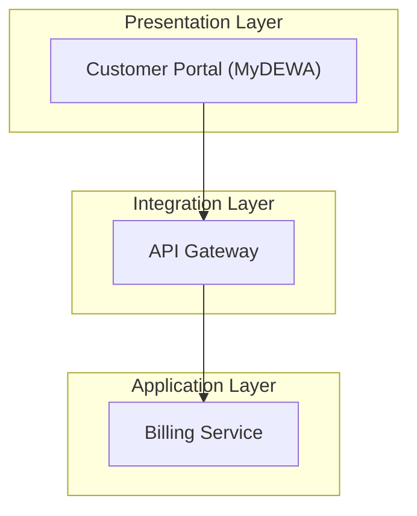

## Description

SA Diagram Design produces DEWA-standard Solution Architecture diagrams using the 5-Layer Architecture model (Presentation, Application, Integration, Data, Infrastructure). Outputs include Mermaid-format diagrams for OpenFlowKit import, layer mappings, and integration view specifications aligned with TOGAF and DEWA EA Framework 4.0.

**Standards:** DEWA 5-Layer Architecture, TOGAF, EA Framework 4.0
**Discovered from:** "Show the system integration view for the uploaded BRD with DEWA APIs and security boundaries"

## Trigger Conditions

- User asks to draw, design, or generate a solution architecture or integration view
- User asks for a visual representation of a system or integration scenario
- User uploads an HLD or BRD and requests a corresponding architecture diagram
- User references OpenFlowKit, Mermaid, or asks to export to a diagram tool
- User asks how components, services, or systems connect in a given solution

## Inputs

| Input              | Type         | Required  | Description |
|--------------------|--------------|-----------|-------------|
| user_query        | text        | required | The user's question or uploaded document content |
| dewa_context      | reference   | optional | DEWA EA knowledge base — systems inventory, principles (auto-loaded) |
| solution_scope    | text        | optional | System or integration scenario to diagram (e.g., 'Smart Meter Portal integration with SAP ISU') |
| dewa_standards    | reference   | optional | DEWA 5-Layer Architecture standards (auto-loaded from knowledge base) |

## Process Steps

1. **Understand the solution scope**: Identify the system, integration, or service to be diagrammed and its boundaries.
2. **Apply DEWA 5-Layer Architecture**: Map all components to the five canonical layers.
   - Layer 1 Presentation: UI, portals, mobile apps, dashboards
   - Layer 2 Application: Business logic, microservices, APIs
   - Layer 3 Integration: ESB, API Gateway, event bus, middleware
   - Layer 4 Data: Databases, data lakes, analytics stores
   - Layer 5 Infrastructure: Cloud/on-prem hosting, networking, security zones
3. **Identify integration points**: List all system-to-system connections, data flows, and protocols.
   - Map to DEWA systems inventory where applicable (SAP, MDMS, MyDEWA, ADFS)
4. **Select diagram view**: Choose the most appropriate view — context, container, component, or integration flow.
   - Default to context or container view for initial design; component for deep-dive reviews
5. **Generate Mermaid code**: Produce valid Mermaid diagram code following DEWA naming conventions.
   - Use double-quoted labels for any text containing brackets, slashes, or special characters
   - Group components by DEWA architectural layer using Mermaid subgraphs
6. **Layer mapping table**: Explicitly document which DEWA layer each component falls into and why.
   - Flag any components that span layers (these are usually integration or security components)
7. **Governance notes**: Identify architectural decisions that require DEWA EA review.
   - New integration patterns not in the DEWA pattern library require EA approval
   - Any component handling personal data must include a data classification note
8. **Assumptions and constraints**: State any assumptions made about missing information in the source documents.

## Output Format

```
# Solution Architecture Diagram — [Solution Name]
**View type:** [Context / Container / Integration Flow]
**DEWA standard:** 5-Layer Architecture

## Architecture Diagram (Mermaid)


## DEWA Layer Mapping

| Component      | DEWA Layer     | Rationale                                |
|----------------|----------------|------------------------------------------|
| Customer Portal | Presentation  | User-facing web/mobile interface         |
| API Gateway    | Integration    | Central request routing and auth gateway |

## Integration Points

| Source System  | Target System | Protocol | Data Exchanged |
|----------------|---------------|----------|----------------|
| [system]       | [system]      | REST/SOAP| [payload]      |

## Governance Notes
- [Any new integration patterns requiring EA approval]
- [Data classification notes for personal data components]

## Assumptions
- [List any assumptions made where source documentation was unclear]
```

## Evaluation Rubric

| Criterion                      | Weight | 1 (Poor)                                      | 3 (Adequate)                                  | 5 (Excellent) |
|--------------------------------|--------|-----------------------------------------------|-----------------------------------------------|---------------|
| DEWA 5-Layer compliance       | 25%    | Components not mapped to layers              | Layers mentioned but not enforced            | All components correctly assigned to one of the 5 DEWA layers |
| Integration accuracy          | 25%    | Integration points missing or wrong          | Key integrations shown without protocols     | All integration points with system names, protocols, and data exchanged |
| Mermaid validity              | 20%    | Invalid Mermaid code that fails to render    | Renders but with warnings                    | Clean render with DEWA-standard labels and subgraph grouping |
| DEWA systems alignment        | 15%    | Generic system names not in DEWA inventory   | Some DEWA systems named                      | All systems reference DEWA inventory names; unknowns flagged |
| Completeness of outputs       | 15%    | Diagram only, no supporting artefacts        | Diagram with partial layer table             | Diagram + layer mapping + integration table + governance notes |

## Test Cases

### TC-01: Smart Meter Portal
- **Input:** "Draw the solution architecture for DEWA Smart Meter customer portal integrating with SAP ISU and MDMS."
- **Expected output:** 5-layer diagram with Portal (Presentation), API (Application), ESB (Integration), SAP ISU + MDMS (Data/Application), cloud infra (Infrastructure).
- **Pass criteria:** All 5 layers populated; SAP ISU and MDMS appear; integration protocols specified; Mermaid renders without error

### TC-02: Mobile App Integration
- **Input:** "Show how the MyDEWA mobile app connects to backend billing and notifications."
- **Expected output:** Context diagram: MyDEWA → API Gateway → Billing Service → SAP ISU; push notification via Firebase in Infrastructure.
- **Pass criteria:** API Gateway in Integration layer; MyDEWA in Presentation; ≥2 backend systems in Application/Data layer

### TC-03: Ambiguous Scope
- **Input:** "Draw an architecture diagram for our new digital portal."
- **Expected output:** Asks clarifying questions via assumptions section; produces a generic DEWA 5-layer template with placeholders.
- **Pass criteria:** Assumptions section lists ≥3 questions; output includes all 5 layer placeholders even if components are generic

## Human Approval Points

- Diagrams showing new integration patterns not in the DEWA pattern library must be reviewed by the EA Integration Architect before communicating to project teams
- Any diagram including a data store for personal or sensitive data requires a data classification review by the DEWA Data Governance team
- Diagrams presented to project steering committees must be reviewed by an EA lead for accuracy before publication

## Notes

This skill file was auto-generated by Ask EA Skill Discovery on initial adoption.
Run the Skill Improvement Loop (`/improve-skill ea-sa-diagram-design`) to further enrich
it with DEWA-specific depth based on real evaluation data.
